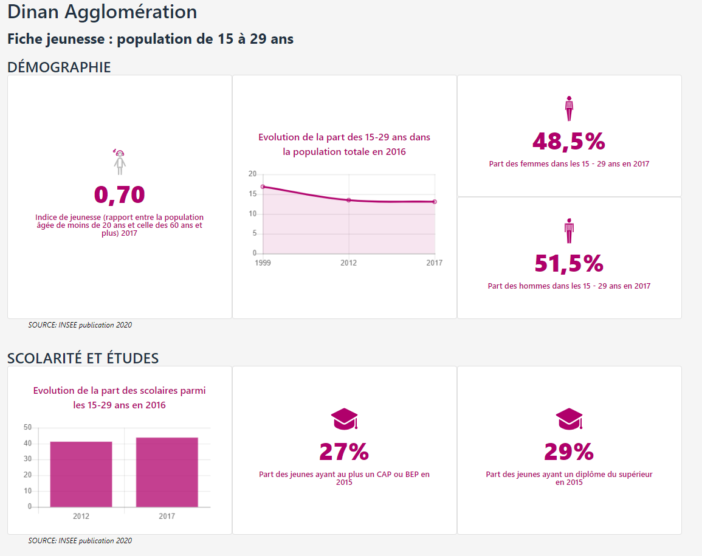

# mreport

**mreport** est un outil simple de **reporting web** qui permet de composer des rapports combinant **chiffres-clés**, **graphiques**, **images**, **textes** à partir de jeux de données intégrés dans la base de données de la solution. Un même rapport peut être valable pour un **référentiel d'identités** (Communes, EPCI,  gares...)

Les rapports générés restent "connectés"   aux données sources et sont affichables sur mobile, ordinateur et imprimables au format A4 pour un export pdf par exemple.

Outre l'aspect reporting, mreport dispose d'une **API** permettant de réutiliser les dataviz disponibles dans un rapport et de les intégrer dans un autre outil web ou un CMS ou mviewer.

## Documentation

* Présentation [PRESENTATION.md](docs/PRESENTATION.md)
* Installation [INSTALL.md](docs/INSTALL.md)
* Structuration des données [DATA.md](docs/DATA.md)
* Interface d'administration [ADMIN.md](docs/ADMIN.md)
* Principes [PRINCIPES.md](docs/PRINCIPES.md)
* Production [PRODUCTION.md](docs/PRODUCTION.md)
* Multiples instances [INSTANCES.md](docs/INSTANCES.md)
* Docker [DOCKER.md](docs/DOCKER.md)

## Capture

