# Interface admin

*Pour expliquer au mieux les différentes pages de l'admin nous utilisons les données demo qui sont présent demo.sql*

L'interface admin se décompose en 3 pages :

* Les données
* Les rapports
* Le composeur

## Données

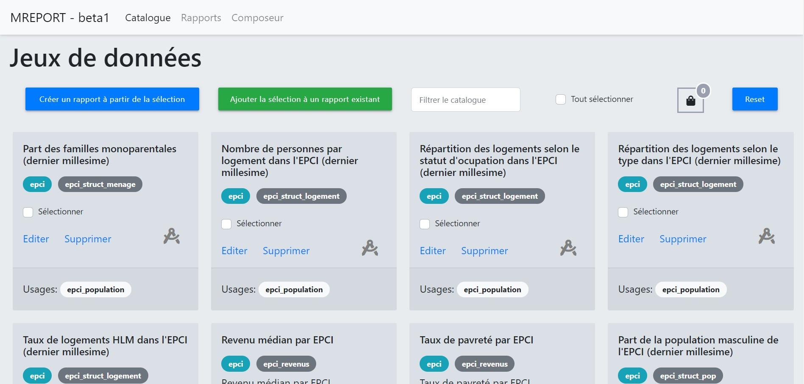

La page données affiche chaque jeux de donnée qui se trouve dans la table dataviz de la base de données.

Ici vous pouvez sélectionner les jeux de données à utiliser dans un rapport.

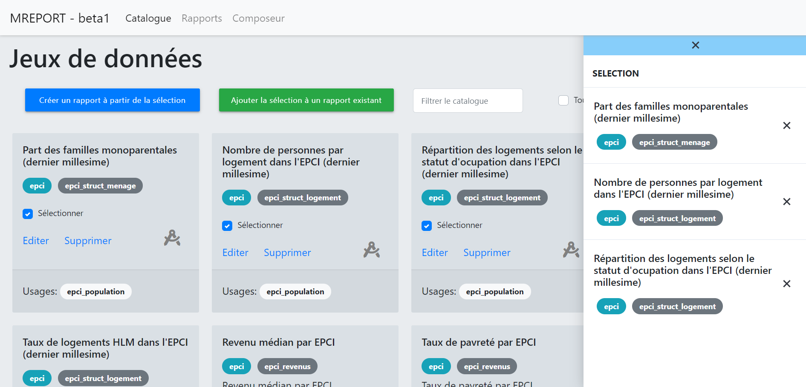

A partir de cette séléction il a possible de créer un nouveau rapport ou d'ajouter ces données à un rapport existant.

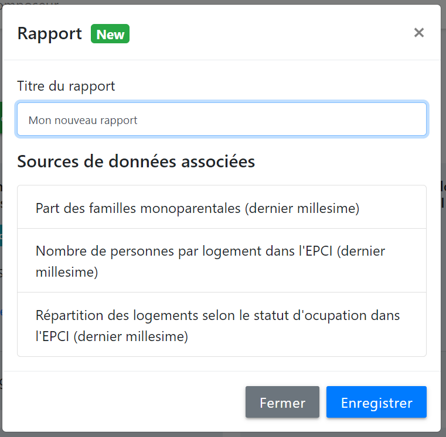

ou

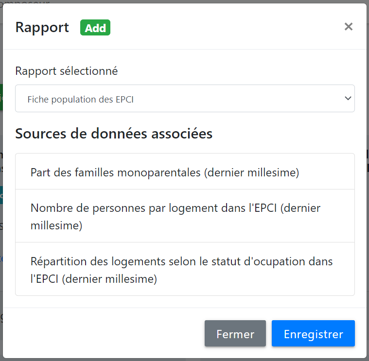

Comme autre fonctionnalité ici vous pouvez chercher un jeux de données avec un filtre et avec le filtre avancé il est possible de filtre les dataviz selon leur référentiel.

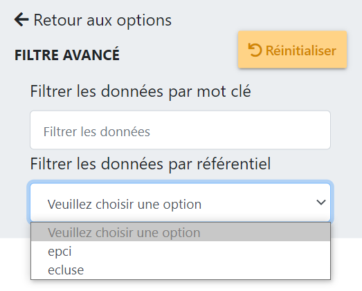

Vous pouvez aussi rinitaliser la séléction et trier par ordre alphabétique les dataviz.

### Import de données

Dans cette même page, le bouton Importer en haut à gauche permet d'importer des données dans la base de données pour une réutilisation dans les rapports.
Tout d'abord en important un fichier CSV :

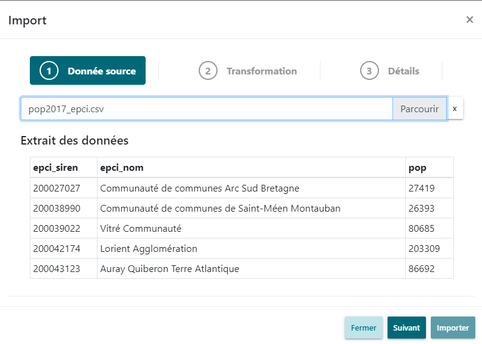

Ce fichier CSV devra contenir au moins 3 informations que l'on associera aux champs existants dans la base (data, label, code_geo) :
- le code identifiant l'entité sur laquelle porte la dataviz
- le nom de l'entité
- la donnée

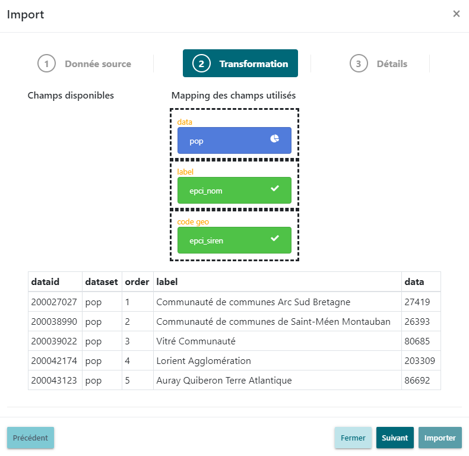

Et enfin, les détails sur la dataviz :
- le nom
- la source
- la description
- le millésime
- le référentiel
- l'unité

En cliquant sur Importer, la dataviz sera importée en base de données et pourra être réutilisée dans les rapports.

## Rapports

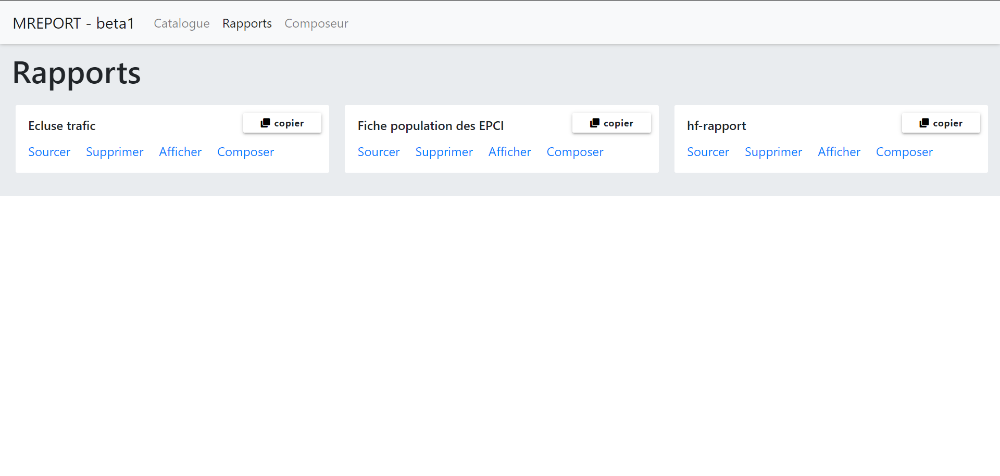

Sur la page rapports nous pouvons voir les rapports qui se trouvent dans la table report de la base de données. 

Pour un rapport c'est possible de modifier les jeux de données qui le composent

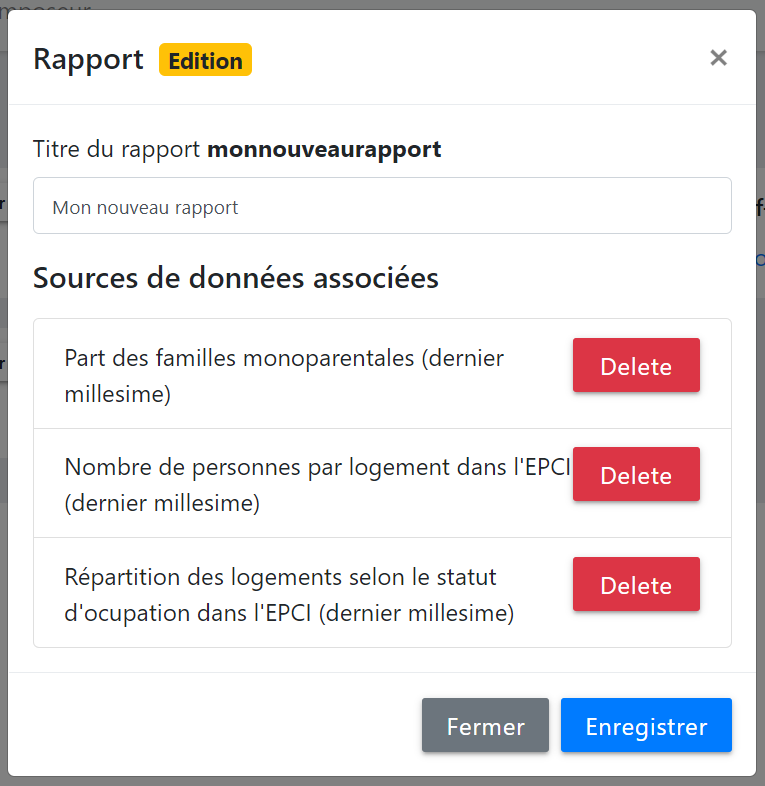

A ce même endroit il y a les options de supprimer un par un les rapports ou par lot, afficher ou composer le rapport ainsi que le copier/dupliquer.

Comme pour la page données vous pouvez trier les rapports par leur titre ou encore filtrer les rapports avec une recherche

## Composeur

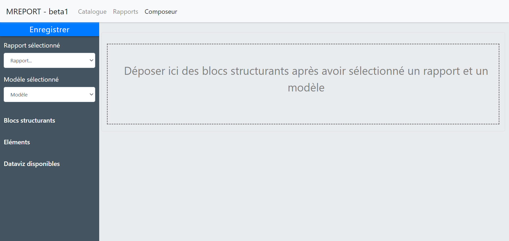

Dans le composeur il y a trois blocs, les options en dessous le menu, les blocs structrants et données à gauche et la structuration du rapport sur le reste de la page. 

En ce qui concernce les options il faut dans un premier temps choisir quel rapport utiliser:

Ensuite choisir un modèle de mise en page.

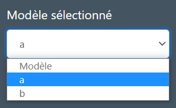

Dans une version future il sera possible de choisir quel version du rapport utilsier, et donc re basculer sur un rapport antérieur si besoin. ca ser un système de versionnement.

Avec un glisser déposer des élements à gauche, il faut ajouter les blocs qui vont structurer le rapport dans la section princpale.

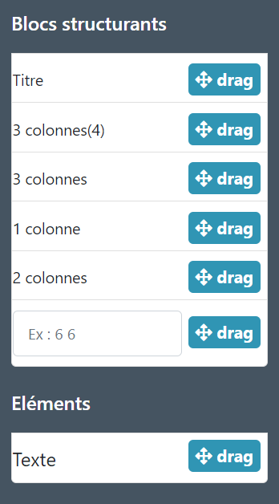

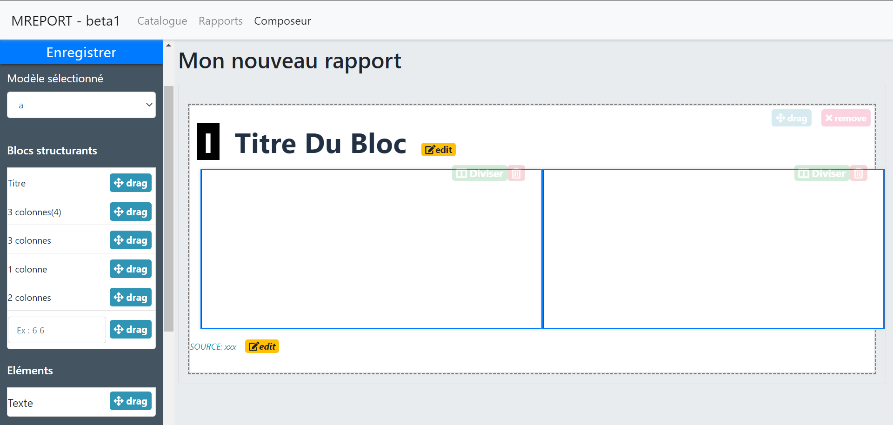

Une fois la structure ajouté, avec la même action du glisser déposer, ajouter les jeux de données au structure.

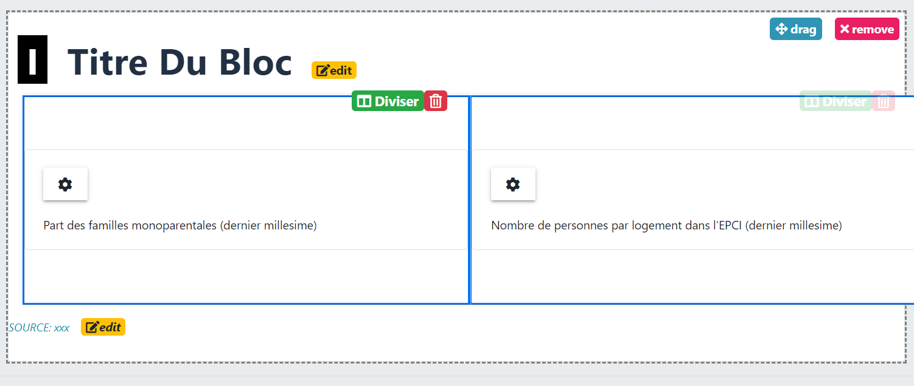

Une fois le jeux de données en place il est alors possible de configurer leur affichage en cliquant sur l'engrenage.

Dans la fenêtre qui s'affiche plusieurs options de configuration sont présent. 

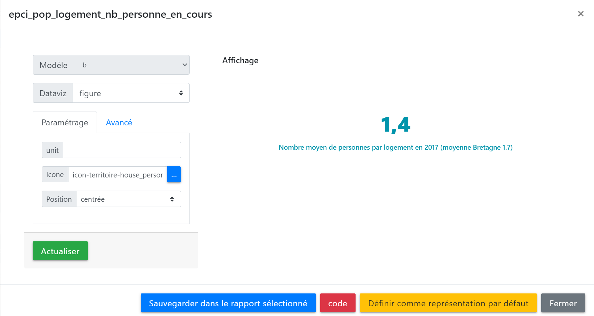

Le type défini dans dataviz pour cette exemple est figure, il y a donc des paramètres prédéfinis pour ce type.

Une fois votre rapport structuré avec les données et les dataviz, vous pouvez l'enregistrer et l'afficher votre rapport ou continuer de le modifier.
