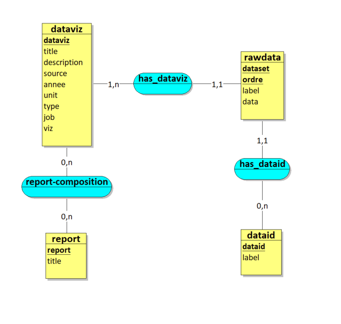

# Structuration des données.

## 1 - La base de données

La base de données de l'application est constituée de 7 tables.

* La table **dataid** liste tous les identités des réferentiels disponibles (exemple: Codes des EPCIs, Codes des écluses, Codes RNE pour les lycées, ...etc).
* La table **level_type** liste tous les enitités des réferentiels (exemple: Communes, EPCI, gares, ...etc).
* Les 2 tables **dataviz** et **rawdata** contiennent les données qui servant à réaliser les dataviz utilisé dans la génération de reports. **dataviz** contient les metadonnées, c'est le catalog qui est affiché dans l'application.
* La table **report**continent tous les rapports créés avec leur id et leur titre, qui est alimenté par l'application Mreport.
* La table **report_composition**  est une tables d'association qui lié les rapports au dataviz. elle permet de savoir quelle rapport utilise quelle donnée et quelle données est présent dans quel rapport.
* La table **report_definition** sera utiliser pour la fonctionnalité de versionnement des rapports. Pour l'instant elle n'est pas utilisé. Elle stockera des JSONs utilisés pour reconstruire un rapport et sera alimenté par un nouveau système d'enregistrement des rapports (CF issue 113)

Ci-dessous le MCD de la base de donnée. Les relations '1,1' de rawdata avec dataviz et dataid montre que rawdata a besoin d'utiliser les données des deux autres tables. Il y a un ordre d'alimentation des tables à respecter selon les cardinalités.

L'association '0,n' entre dataviz et report fait la table d'association report_composition. Cela permet de lier un report et un dataviz.

Entre level_type, dataviz et dataid il y a une contrainte de simultaneité. Un élement level_type qui existe dans dataviz va forcement exister dans dataid et inversement.

## 2 - Process d'alimentation

### Etape 1 : alimenter la table dataid

Cette table est le référentiel des identifiants. Elle est constituée de 2 champs (dataid et label).

Exemple:

dataid | label
-------|------
35001 | Acigné
ecl_1 | Ecluse du soleil

Il sera possible via l'API d'afficher le rapport (exemple: monrapport ) préalablement créé pour cette identité en utilisant le champ dataid.
Exemples : 
``/mreport/monrapport/35001``
``/mreport/monrapport/ecl_1``

*Pour les deux prochaines étapes nous allons les illustrer avec ce cas d'usage : créer un chiffre clé pour le référentiel écluses relatif au passage de bâteaux*

### Etape 2 : alimenter la table dataviz

#### Table dataviz :

Cette table recupère les metadonnées lié à la donnée. 

dataviz | title | description | source | year | unit | type | level | job | viz
--------|-------|-------------|--------|------|------|------|-------|-----|----
figure_1 | Passages mensuels | - | RB | 2019 | - | figure | ecluse | - | -

### Etape 3 : alimenter la table rawdata

#### Table rawdata :

Comme précisé dans le MCD la table rawdata nécéssite de reprendre les données de dataid et dataviz.

dataid | dataviz | dataset | order | label | data
-------|---------|---------|------|--------|-----
ecl_1 | figure_1 | 1 | 1 | Nombre total de passage de bâteaux | 483
ecl_2 | figure_1 | 1 | 1 | Nombre total de passage de bâteaux | 218

## 3 - Exemples

Exemple de titre
------------------

*dataset*, *data* & *order* ne sont pas utilisés pour ce cas de figure.

dataid | dataviz | dataset | order | label | data
-------|---------|---------|------|--------|-----
ECLUSE_1 | title | 1 | 1 |ECLUSE N°1 |

Exemple de texte
------------------

*dataset* & *order* ne sont pas utilisés pour ce cas de figure.

dataid | dataviz | dataset | order | label | data
-------|---------|---------|------|--------|-----
ECLUSE_1 | text_1 | 1 | 1 | Descriptif 1 | Lorem ipsum dolor sit amet. consectetur adipiscing elit. Ut id urna faucibus. blandit tellus a. aliquet massa. Vivamus non mollis arcu. Phasellus nec sem eget massa fa...

Exemple de graphique
------------------

Ici on comprends à quoi sert *order*, notamment lorsqu'il y a des notions de temps et ordre à respecter.

Exemple de données dans rawdata:

dataid | dataviz | dataset | order | label | data
-------|---------|---------|------|--------|-----
ECLUSE_1 | chart_1 | 1 | 1 | 9h-10h | 28
ECLUSE_1 | chart_1 | 1 | 2 | 10h-11h |72
ECLUSE_1 | chart_1 | 1 | 3 | 11h-12h | 81
ECLUSE_1 | chart_1 | 1 | 4 | 12h-13h | 38
ECLUSE_1 | chart_1 | 1 | 5 | 13h-14h | 16
ECLUSE_1 | chart_1 | 1 | 6 | 14h-15h | 59
ECLUSE_1 | chart_1 | 1 | 7 | 15h-16h | 53
ECLUSE_1 | chart_1 | 1 | 8 | 16h-17h | 61
ECLUSE_1 | chart_1 | 1 | 9 | 17h-18h | 45
ECLUSE_1 | chart_1 | 1 | 10 | 18h-19h | 18
ECLUSE_1 | chart_1 | 1 | 11 | 19h-20h | 1

Son rendu sour forme de chart:

Exemple de tableau
------------------

*dataset* sert lorsqu'il y a deux données parallèles sur le même *order*

Exemple de données dans rawdata:

dataid | dataviz | dataset | order | label | data
-------|---------|---------|------|--------|-----
ECLUSE_1 | table_1 | 01_mois | 1 | Mois | Janvier |
ECLUSE_1 | table_1 | 02_passage | 1 | Passage | 12 |
ECLUSE_1 | table_1 | 01_mois | 2 | Mois | Février |
ECLUSE_1 | table_1 | 02_passage | 2 | Passage | 22 |
ECLUSE_1 | table_1 | 01_mois | 3 | Mois | Mars |
ECLUSE_1 | table_1 | 02_passage | 3 | Passage | 222

Son rendu sous forme de table:

Exemple de chiffre clé
------------------

*dataset* & *order* ne sont pas utilisés pour ce cas de figure.

dataid | dataviz | dataset | order | label | data
-------|---------|---------|------|--------|-----
ECLUSE_1 | figure_1 | 1 | 1 | Nombre total de passage de bâteaux | 483

Exemple de carte
------------------

Un marquer par type de *dataset*. 

*data* ici est un WKT POINT

Exemple de données dans rawdata:

dataid | dataviz | dataset | order | label | data
-------|---------|---------|------|--------|-----
ECLUSE_1 | map_1 | point_1 | 1 | ECLUSE N°1a | POINT(-1.5, 48.2)
ECLUSE_1 | map_1 | point_1 | 2 | ECLUSE N°1b | POINT(-1.55, 48.25)

Son rendu sous forme de carte:

Exemple d'image
------------------

*dataset* & *order* ne sont pas utilisés pour ce cas de figure.

Exemple de données dans rawdata:

dataid | dataviz | dataset | order | label | data
-------|---------|---------|------|--------|-----
ECLUSE_1 | image_1 | 1 | 1 | Image 1 | http://kartenn.region-bretagne.fr/img/vn/ecluse/ECL_IR33.jpg

Exemple d'iframe
------------------

*dataset* & *order* ne sont pas utilisés pour ce cas de figure.

Exemple de données dans rawdata:

dataid | dataviz | dataset | order | label | data
-------|---------|---------|------|--------|-----
ECLUSE_1 | iframe_1 | 1 | 1 | Iframe 1 | http://kartenn.region-bretagne.fr/sviewer/?layers=rb:lycee
