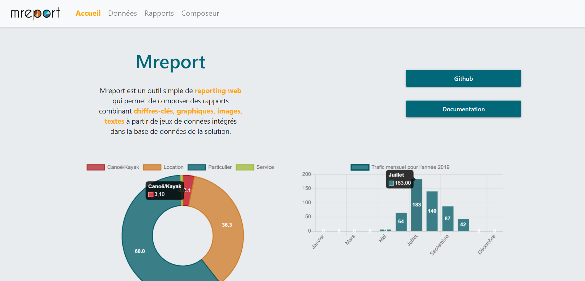
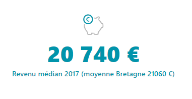
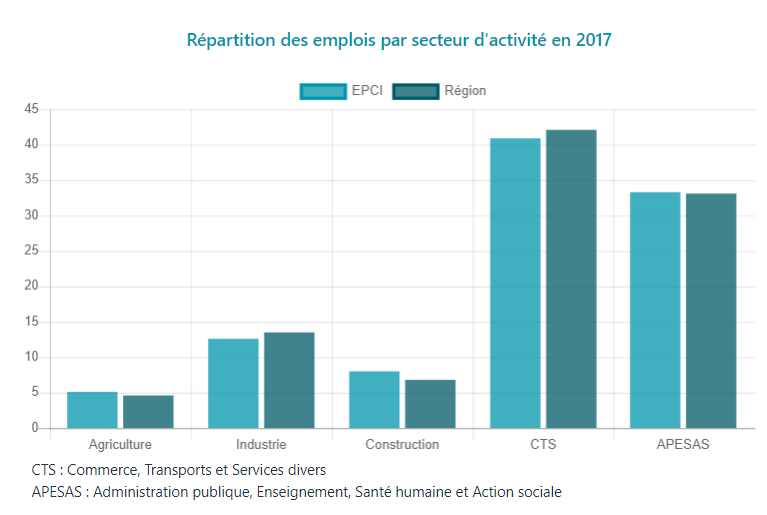
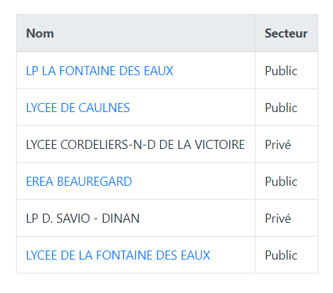
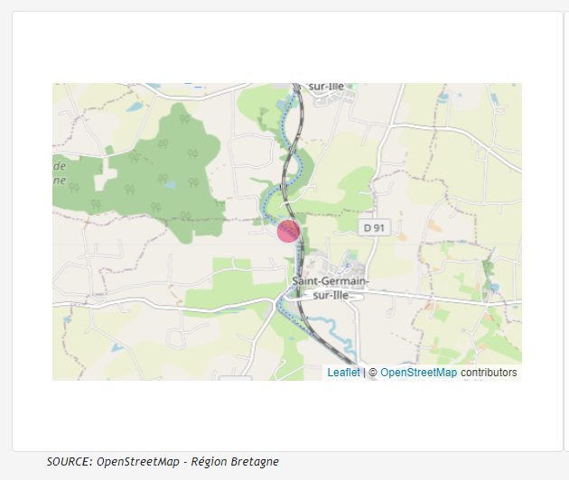
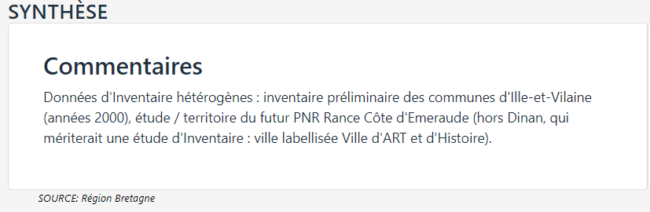
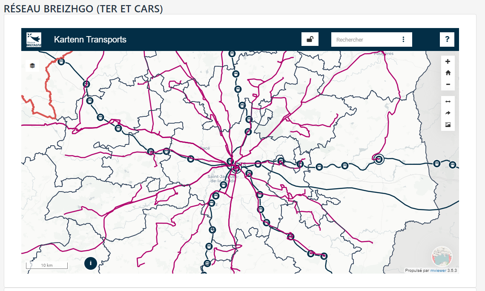

# mreport

mreport est un outil simple de **reporting web** qui permet de composer des rapports combinant **chiffres-clés**, **graphiques**, **images**, **textes** à partir de jeux de données intégrés dans la base de données de la solution. Un même rapport peut être valable pour un référentiel de localisation (Communes, EPCI,  gares...)

Les rapports générés restent "connectés"   aux données sources et sont affichables sur mobile, ordinateur et imprimables au format A4 pour un export pdf par exemple.

Outre l'aspect reporting, mreport dispose d'une **API** permettant de réutiliser les dataviz disponibles dans un rapport et de les intégrer dans un autre outil web ou un CMS.

## API

`/mreport/monrapport`  :  affiche la liste des localisants disponibles pour monrapport

`/mreport/monrapport/unlocalisant`  :  affiche le rapport  monrapport pour un localisant donné

`/mreport/monrapport/unlocalisant/madataviz`  :  affiche la dataviz  disponible dans monrapport pour un localisant donné

## Types de représentations (dataviz) disponibles

* ### Chiffres clés :

* ### Graphiques :

*  ### Tableaux :

*  ### Cartes :

*  ### Textes :

*  ### Images :

*  ### Contenus embarqués :

Ici un exemple avec une application mviewer

## Données

Pour pouvoir créer un représentation des données sous la forme de dataviz, les données doivent être intégrées dans la base de l'application avec le formalisme propre à **mreport**.

Les données peuvent être intégrés avec un ETL ou en utilisant la fonction d'import depuis l'interface d'admin (pour les représentations simples).

[En savoir plus sur la structuration et l'import des données](DATA.md)

## Interface d'administration

L'interface d'aministation est l'interface web qui va nous permettre de créer nos rapports.

[En savoir plus](ADMIN.md)

## Installation

Guide d'installation de mreport.

[Installation](INSTALL.md)

## Principes de fonctionnement

[Principes](PRINCIPES.md)

